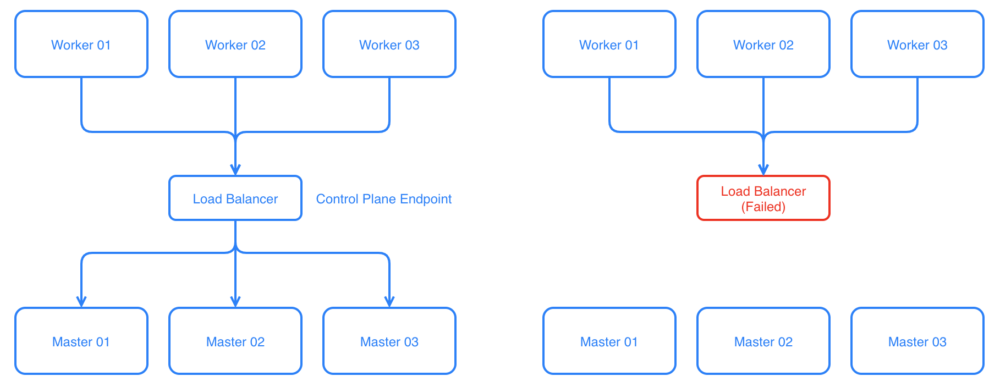
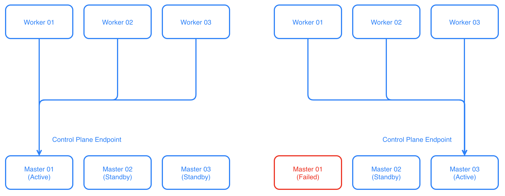
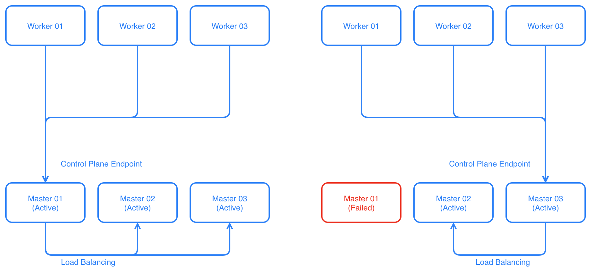

# Kubernetes Control Plane with keepalived

<p align="center">
  
  <a href="https://github.com/clastix/kubelived/releases">
    
  </a>
</p>

In a typical kubernetes setup, we have worker nodes and master nodes. Master nodes run the api-server, the etcd database, and the controllers. These nodes implement the so-called Control Plane, i.e. the brain of your Kubernetes cluster. Worker nodes talk to the Master nodes using the Control Plane Endpoint, usually a hostname or an IP address which tells all the nodes how to reach the Control Plane.

## What problem does it solve?
In many production environments, it is desirable to have a Kubernetes Control Plane that is resilient to failure and highly available. For clusters operating in public cloud environments the options and the methodology are usually straightforward: main cloud providers as AWS, GCP, Azure, have their own HA solutions which will work very well, and these should be preferred when operating in such environments.

For private cloud deployments, and edge deployments, there are several different options, and most of them are based on hardware load-balancers. This project provides the strategy and methodology for a cheaper software solutions only. However, if you have a hardware load-balancer, that would bee obviously a better option.

In such environments, the worker nodes all use the load-balancer to talk to the control plane. This will balance the load to the master nodes, but we have just moved the single point of failure from the masters to the load-balancer.



So the solution is to rely on a second instance of the load-balancer to protect the first one when it fails.


As this makes sense in many cases, in other cases, it may be too expensive both in terms of costs and operations.

As a cheaper solution, we'll use a floating Virtual IP address (aka VIP) in front of the masters. It works well without any load balancing if your cluster won’t generate enough control traffic to saturate a single master. If you just want high availability on the control plane, a VIP based solution is a solid choice.



The active master node owns the VIP handling all the traffic coming from workers and directed to the api-server while the other two masters are in stand-by mode. Well, this is not completely true since they still run the etcd database and the other components of the control plane.

When the active master fails, the VIP is immediately passed to the next master that becomes the active master. Depending on the configuration, when the failed master is recovered, the VIP is passed back to it. This mechanism can guarantee the high availability of the control plane against different types of failures, including hardware and software.

However, if you still want all your master nodes to actively handle traffic coming from worker nodes, you can extend the solution above with very little effort by introducing a thin load-balancer layer as in the following picture.



In this guide, we present a floating Virtual IP address solution for Kubernetes and Openshift control plane based on the battle-tested [keepalived](https://www.keepalived.org/) project by [Alexandre Cassen](https://github.com/acassen).


## What is keepalived?
Keepalived is free software distributed under the terms of the GNU General Public License.

Quote from the [website](https://www.keepalived.org/):

*Keepalived is a routing software written in C. The main goal of this project is to provide simple and robust facilities for load-balancing and high-availability to Linux system and Linux based infrastructures. Loadbalancing framework relies on a well-known and widely used Linux Virtual Server (IPVS) kernel module providing Layer4 load-balancing. Keepalived implements a set of checkers to dynamically and adaptively maintain and manage a load-balanced server pool according to their health.*

*On the other hand high-availability is achieved by VRRP protocol. VRRP is a fundamental brick for router failover. Also, Keepalived implements a set of hooks to the VRRP finite state machine providing low-level and high-speed protocol interactions. To offer faster network failure detection, Keepalived implements the BFD protocol. VRRP state transition can take into account the BFD hint to drive fast state transition. Keepalived frameworks can be used independently or all together to provide resilient infrastructures.*

## Running keepalived as container  
Keepalived runs on most of the modern Linux distributions as `systemd` daemon. In this guide, we propose a containerized version of it, not only just for fun. We want to run `keepalived` as part of the Kubernetes Control Plane and having strictly coupled with it. In our implementation, the `keepalived` is managed by the `kubelet` daemon running on every Kubernetes node. It is deployed as a static pod along with the other components: the `apiserver`, the `etcd` data store, the `controller-manager`, and the `scheduler`.

First, we need to place `keepalived` in a Docker image:

```Dockerfile
FROM alpine:3.10

LABEL architecture="x86_64" \
    license="Apache 2" \
    name="keepalived" \
    summary="Alpine based keepalived container" \
    mantainer="bsctl"

RUN  apk add --no-cache curl keepalived
ENTRYPOINT ["/usr/sbin/keepalived","--dont-fork","--log-console"]

# Customise keepalived with:
# CMD ["--vrrp","--log-detail","--dump-conf"]
```

Since keepalived is compiled against specific versions of the Linux kernel, it is very important to have the Docker image aligned to the kernel running on your machines. For older kernels, e.g. 3.10, running in the CentOS 7 distribution, we build the image with Alpine 3.7 which provides `keepalived` 1.3 version. On the other side, for newer kernels, we build with Alpine 3.8+ as it uses more recent `keepalived` versions.

## Keepalived basics
There are plenty of tutorials out there explaining the keepalived basics. However, we suggest checking the official [documentation](https://www.keepalived.org/manpage.html).

Keepalived implements Virtual Router Redundancy Protocol, also known as VRRP. Usually, the VRRP protocol ensures that only one of the participating instances is running as MASTER. The other instances are in the BACKUP state listening for multicast packets from an instance with a higher priority. 

If the BACKUP instance fails to receive VRRP advertisements for a period longer than the KEEPALIVED_ADVERT_INT, the BACKUP instance moves to the MASTER state and it takes the VIP for itself. In case there is more than one instance in BACKUP state with the same priority, the instance with the highest IP wins. There is no fencing mechanism available: if two participating instances don't see each other (split-brain scenario), both will have the MASTER state and both will carry the same VIP.

### VRRP configuration
A typical VRRP configuration for keepalived looks like

```
vrrp_instance VI_1 {
    state {{ KEEPALIVED_STATE }}
    interface {{ KEEPALIVED_INTERFACE }}
    virtual_router_id {{ KEEPALIVED_ROUTER_ID }}
    priority {{ KEEPALIVED_PRIORITY }}
    advert_int {{ KEEPALIVED_ADVERT_INT }}
    authentication {
        auth_type PASS
        auth_pass {{ KEEPALIVED_PASSWORD }}
    }

    track_script {
        {{ KEEPALIVED_HEALTH_SERVICE_NAME }}
    }

    unicast_peer {
    {{ KEEPALIVED_UNICAST_PEERS }}
    }
    
    virtual_ipaddress {
        {{ KEEPALIVED_VIRTUAL_IP }} label {{ KEEPALIVED_INTERFACE }}:VIP
    }
}
```

We start off by telling keepalived to communicate with its peers over KEEPALIVED_INTERFACE. We set the instance state option to KEEPALIVED_STATE. This is the initial value that keepalived will use until the daemon contacts the other instances and hold an election. During the election, the priority option KEEPALIVED_PRIORITY is used to decide which member is elected and the decision is simply based on which instance has the highest number. We can force the priority of the keepalived instance but, in our implementation, if this option is left unassigned, the latest octet of the node's IP address is used.

The KEEPALIVED_ROUTER_ID option should be shared by all the keepalive instances participating in the same multicast group. By default, keepalived advertises on the multicast group `224.0.0.18`. If multicast is not enabled on the network, alternatively, we can switch to unicast by defining a list of unicast peers specified into the KEEPALIVED_UNICAST_PEERS option.

Also, we can set up a simple authentication based on KEEPALIVED_PASSWORD for our keepalived instances to communicate with one another.

Finally, we assign the KEEPALIVED_VIRTUAL_IP option. The VIP will be taken by the instance is in the MASTER state and assigned to the KEEPALIVED_INTERFACE of the node as subinterface in the form of KEEPALIVED_INTERFACE:VIP, for example, eth0:VIP.

Of course, many other options are available to configure keepalived but the above is enough for solving our initial problem. 

### Track Script
A track script referred by the KEEPALIVED_HEALTH_SERVICE_NAME option is a script written in the language of your choice which is executed regularly. This script KEEPALIVED_HEALTH_SERVICE_CHECK needs to have a return value: 0 for "*everything is fine*" and other than 0 for "*something went wrong*". This value is used by keepalived to take action. Track scripts configuration for keepalived are defined like this:

```
vrrp_script {{ KEEPALIVED_HEALTH_SERVICE_NAME }} {
   script  "{{ KEEPALIVED_HEALTH_SERVICE_CHECK }}"
   interval {{ KEEPALIVED_HEALTH_SERVICE_INTERVAL }}
   timeout  {{ KEEPALIVED_HEALTH_SERVICE_TIMEOUT }}
   rise     {{ KEEPALIVED_HEALTH_SERVICE_RISE }}
   fall     {{ KEEPALIVED_HEALTH_SERVICE_FALL }}
   user     {{ KEEPALIVED_HEALTH_SERVICE_USER }}
}
```

It's possible to specify the user running the script, along with the interval in seconds and how many times the script needs to succeed or fail until any action is taken and a timeout.

The script can check anything we want. As soon as the tracking script returns another code than 0, the VRRP instance will change the state to FAULT, removes the VIP from the network interface, and stops sending VRRP advertisements. In our case, we will write a simple script checking the health status of the Kubernetes api-server.

## Keepalived as part of the control plane
We want keepalived deployed as part of the Kubernetes control plane running on the master nodes along with the other components: the apiserver, the etcd database, and the controllers. In many Kubernetes distributions, including Red Hat OpenShift, these components are running as privileged containers and deployed as static pods.

### Static pods
Static pods are managed directly by the `kubelet` daemon running on the node, without the api-server involvement. Unlike regular pods that are managed by the control plane instead, the kubelet watches static pods and restarts them when they crash.

The kubelet automatically creates a mirror pod on the api-server for each static pod. This means that the pods running on a node are visible on the API server, but cannot be controlled from there.

For example:

    $ kubectl -n kube-system get pods

    NAME                               READY   STATUS    RESTARTS  AGE
    etcd-master-0                      1/1     Running   1         14d
    etcd-master-1                      1/1     Running   1         14d
    etcd-master-2                      1/1     Running   1         14d
    kube-apiserver-master-0            1/1     Running   1         14d
    kube-apiserver-master-1            1/1     Running   1         14d
    kube-apiserver-master-2            1/1     Running   1         14d
    kube-controller-manager-master-0   1/1     Running   1         14d
    kube-controller-manager-master-1   1/1     Running   1         14d
    kube-controller-manager-master-2   1/1     Running   1         14d
    kube-scheduler-master-0            1/1     Running   1         14d
    kube-scheduler-master-1            1/1     Running   1         14d
    kube-scheduler-master-2            1/1     Running   1         14d
    ...

Static pods are created by the kubelet by watching a specific directory on the node. When installing Kubernetes with the `kubeadm` tool, by default, this directory is `/etc/kubernetes/manifest`.

### Manifest for keepalived static pod
The following [kube-keepalived.yaml](./kube-keepalived.yaml) is the manifest file we use to deploy a keepalived static pod on every master node:

```yaml
# Kubernetes: manifests for static pods are in /etc/kubernetes/manifests
apiVersion: v1
kind: Pod
metadata:
annotations:
  scheduler.alpha.kubernetes.io/critical-pod: ""
labels:
  app.kubernetes.io/name: kubelived
  app.kubernetes.io/instance: kubelived
name: kube-keepalived
namespace: kube-system
spec:
containers:
- name: keepalived
  image: bsctl/keepalived:0.2.0
  imagePullPolicy: Always
  args: # override options in the Dockerfile
  - --vrrp
  - --log-detail
  - --dump-conf
  - --use-file=/etc/keepalived/keepalived.conf
  livenessProbe:
    exec:
      command: ["pidof", "keepalived"]
    initialDelaySeconds: 10
  securityContext:
    privileged: true
    capabilities:
      add:
      - NET_ADMIN
  resources:
  volumeMounts:
  - mountPath: /etc/localtime
    name: host-localtime
  - mountPath: /etc/keepalived/keepalived.conf
    name: config
hostNetwork: true
priorityClassName: system-node-critical
restartPolicy: Always
volumes:
- hostPath:
    path: /etc/localtime
  name: host-localtime
- hostPath:
    path: /etc/keepalived/keepalived.conf
  name: config
```

Suppose, we have three master nodes with following IP addresses assigned to their `eth0` network interface:

* master-0: 10.10.10.10
* master-0: 10.10.10.11
* master-2: 10.10.10.12
 
The floating VIP is 10.10.10.250 and it will be assigned to the master node with the highest priority. When not passing the priority, it can be calculated as the last octet of the node's IPv4 address. According to the VRRP protocol, the VIP will be initially taken by the node with the highest priority.

As track script, we check the healthiness of the Kubernetes api-server as by polling its health URL:

```bash
/usr/bin/curl -s -k https://localhost:6443/healthz -o /dev/null
```

According to the above, the keepalive will move the VIP away from nodes having unhealth api-server.

### Deploying keepalived with Helm
Starting from release 0.2.0, we support the deployment of keepalived via the Helm 3 [chart](./helm).

Make sure you have `kubectl` and `helm` tools installed in your workstation. Also make sure to have admin access to the cluster:


Install through Helm:

    $ helm install kubelived --namespace kube-system

Actually, the Helm chart does not install `keepalived` on the Kubernetes Control Plane. Instead, it deployes installer pods as as daemonset on the master nodes. The installer pods are responsible to deploy the `kube-keepalived.yaml` pod manifest in the `/etc/kubernetes/manifests` folder and the proper `keepalived.conf` configuration file in `/etc/keepalived` location of each master node.

Check the installer pods:

    $ kubectl -n kube-system get pods -o wide | grep keepalived-installer

The installer pods do a lookup to find the proper keepalived interface starting from the VIP specified as `keepalived_virtual_address` parameter in the chart's [values.yaml](./helm/values.yaml).

Check the installation of `keepalived`:

    $ kubectl -n kube-system get pods

    NAME                               READY   STATUS    RESTARTS  AGE
    etcd-master-0                      1/1     Running   1         14d
    etcd-master-1                      1/1     Running   1         14d
    etcd-master-2                      1/1     Running   1         14d
    kube-apiserver-master-0            1/1     Running   1         14d
    kube-apiserver-master-1            1/1     Running   1         14d
    kube-apiserver-master-2            1/1     Running   1         14d
    kube-controller-manager-master-0   1/1     Running   1         14d
    kube-controller-manager-master-1   1/1     Running   1         14d
    kube-controller-manager-master-2   1/1     Running   1         14d
    kube-scheduler-master-0            1/1     Running   1         14d
    kube-scheduler-master-1            1/1     Running   1         14d
    kube-scheduler-master-2            1/1     Running   1         14d
    kube-keepalived-master-0           1/1     Running   1         1m
    kube-keepalived-master-1           1/1     Running   1         1m
    kube-keepalived-master-2           1/1     Running   1         1m

Check the actual keepalived configuration according to the values we passed in the chart:

    $ kubectl -n kube-system exec kube-keepalived-master-2 -- cat /etc/keepalived/keepalived.conf
    
    global_defs {
        default_interface eth0
        enable_script_security 
    }

    vrrp_script apiserver {
    script  "/usr/bin/curl -s -k https://localhost:6443/healthz -o /dev/null"
    interval 20
    timeout  5
    rise     1
    fall     1
    user     root
    }

    vrrp_instance VI_1 {
        state BACKUP
        interface eth0
        virtual_router_id 100
        priority 12
        advert_int 3
        authentication {
            auth_type PASS
            auth_pass cGFzc3dvcmQK
        }

        track_script {
            apiserver
        }
        
        virtual_ipaddress {
            10.10.10.250 label eth0:VIP
        }
    }

### Operating keepalived
To determine whether a keepalive istance is acting as master, we can run the `ip` command on each master node to see where the floating VIP is landed, for example:

    $ sudo ip add show eth0
    2: eth0: <BROADCAST,MULTICAST,UP,LOWER_UP> mtu 1500 
        link/ether aa:bb:cc:dd:ee:ff brd ff:ff:ff:ff:ff:ff
        inet 10.10.10.12/24 brd 10.10.10.255 scope global dynamic eth0
        valid_lft 83641sec preferred_lft 83641sec
        inet 10.10.10.250/32 scope global eth0:VIP
        valid_lft forever preferred_lft forever

according to our expectations, the VIP is held by master-2 since it has the highest priority.

Check the logs and see what happened on master-2 node:

    $ kubectl -n kube-system logs kube-keepalived-master-2

    Wed Apr 22 19:30:31 UTC 2020 /usr/bin/keepalived.sh: keepalived first start
    Wed Apr 22 19:30:31 UTC 2020 /usr/bin/config.sh: filling keepalived config file
    Wed Apr 22 19:30:31 UTC 2020 /usr/bin/config.sh: enabling unicast
    Wed Apr 22 19:30:31 UTC 2020 /usr/bin/keepalived.sh: starting keepalived
    Wed Apr 22 19:30:31 2020: Starting Keepalived v2.0.19 (11/24,2019), git commit v20191114-652-g038556d644
    Wed Apr 22 19:30:31 2020: Running on Linux 4.19.76 #1 SMP Tue Oct 29 14:56:42 PDT 2019 (built for Linux 4.19.36)
    Wed Apr 22 19:30:31 2020: Command line: '/usr/sbin/keepalived' '-nlPdD' '-f' '/etc/keepalived/keepalived.conf'
    Wed Apr 22 19:30:31 2020: Opening file '/etc/keepalived/keepalived.conf'.
    ...
    Wed Apr 22 19:30:31 2020: Tracking VRRP instances = 1
    Wed Apr 22 19:30:31 2020: VI_1, weight 0
    Wed Apr 22 19:30:31 2020: VRRP sockpool: [ifindex(2), family(IPv4), proto(112), unicast(1), fd(11,12)]
    Wed Apr 22 19:30:31 2020: VRRP_Script(apiserver) succeeded
    Wed Apr 22 19:30:31 2020: (VI_1) Entering BACKUP STATE
    Wed Apr 22 19:30:31 2020: VI_1: sending gratuitous ARP for 10.10.10.12
    Wed Apr 22 19:30:31 2020: Sending gratuitous ARP on eth0 for 10.10.10.12
    Wed Apr 22 19:30:41 2020: (VI_1) Received advert with lower priority 10, ours 12, forcing new election
    Wed Apr 22 19:30:41 2020: (VI_1) Entering MASTER STATE
    Wed Apr 22 19:30:41 2020: (VI_1) setting VIPs.
    Wed Apr 22 19:30:41 2020: Sending gratuitous ARP on eth0 for 10.10.10.250
    Wed Apr 22 19:30:41 2020: (VI_1) Sending/queueing gratuitous ARPs on eth0 for 10.10.10.250
    Wed Apr 22 19:30:41 2020: Sending gratuitous ARP on eth0 for 10.10.10.250
    Wed Apr 22 19:30:41 2020: Sending gratuitous ARP on eth0 for 10.10.10.250
    Wed Apr 22 19:30:41 2020: Sending gratuitous ARP on eth0 for 10.10.10.250
    ...

After the keepalived instance started and loaded the configuration file, it puts itself in the BACKUP state but promptly moves to MASTER state having received advertising from its peers with lower priority. 

If you want to see the failover mechanism of VRRP protocol, you can do the following tests on the node holding the VIP 

* move the api-server in a failed state
* shutdown the advertising interface, e.g. `ifdown eth0`
* reboot the machine

Use a background `ping` command against the VIP address during the failover.

### Split-brain scenario
If multiple nodes take the VIP, then they are likely either not receiving VRRP advertisements from the node with the highest priority or have a misconfiguration in their configuration file.

First, check to ensure config files are correct and consistent. In particular, verify that KEEPALIVED_ROUTER_ID, KEEPALIVED_ADVERT_INT, and KEEPALIVED_PASSWORD configuration parameters match.

If the configuration files look good, then verify that nodes participating in VRRP can talk to each other via the KEEPALIVED_INTERFACE bound to VRRP. From the instance that should be BACKUP but thinks it is MASTER, see if it is receiving traffic from the primary node:

    $ sudo tcpdump -i eth0 -nn vrrp
    17:39:20 IP 10.10.10.10 > 10.10.10.11: VRRPv2, Advert, vrid 100, prio 2, authtype simple, intvl 3s, length 20
    17:39:20 IP 10.10.10.10 > 10.10.10.12: VRRPv2, Advert, vrid 100, prio 2, authtype simple, intvl 3s, length 20

## Assign the Control Plane Endpoint to the VIP
Once we have the VIP and the VRRP working correctly, we need to assign the Kubernetes control plane endpoint to the VIP managed by keepalived. The control plane endpoint is the shared endpoint for all the nodes talking to the control plane. Such an endpoint can be either a DNS name or even an IP address.

Depending on the way we deploy the cluster, this endpoint can be required to be already available during the installation. To avoid this "*chicken and egg dilemma*" we can first assign the endpoint DNS name to one of the master nodes, deploy the cluster, and then deploy keepalived as static pods on all the masters. Once we have the floating VIP up and running we can assign the DNS name of the endpoint to the floating VIP.

## Monitoring keepalived
Sending USR1 signal to keepalive process will dump configuration data to `/tmp/keepalived.data`, and sending USR2 will write statistics to `/tmp/keepalived.stats` inside the container.

    $ kubectl -n kube-system exec kube-keepalived-master-0 -- kill -USR1 1
    $ kubectl -n kube-system exec kube-keepalived-master-0 -- cat /tmp/keepalived.stats

    VRRP Instance: VI_1
    Advertisements:
        Received: 0
        Sent: 2505
    Became master: 1
    Released master: 0
    Packet Errors:
        Length: 0
        TTL: 0
        Invalid Type: 0
        Advertisement Interval: 0
        Address List: 0
    Authentication Errors:
        Invalid Type: 0
        Type Mismatch: 0
        Failure: 0
    Priority Zero:
        Received: 0
        Sent: 0

Also, SNMP V2 and V3 MIBs are available to monitor keepalived.